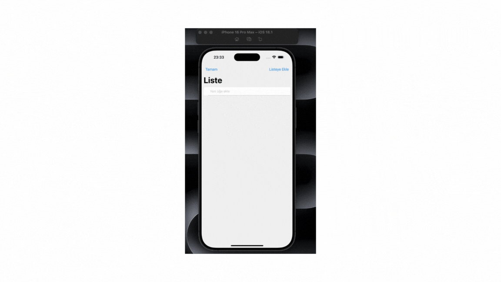

# Rehber
📱 Rehber iOS Uygulaması (React Native)
Bu proje, React Native kullanılarak geliştirilmiş bir Kişi Rehberi Uygulamasıdır. Kullanıcılar uygulama üzerinden kişi ekleyebilir, düzenleyebilir, silebilir ve yerel veritabanında (SQLite) bu verileri saklayabilir. Arayüzde UI Kitten teması, form yönetimi için Formik & Yup, veri yönetimi için Redux kullanılmıştır.

## 🚀 Özellikler
- 👤 Kişi ekleme, güncelleme ve silme
- 📂 SQLite tabanlı yerel veri saklama
- 🎨 UI Kitten bileşenleri ile şık ve uyumlu arayüz
- ✅ Formik ve Yup ile form doğrulama
- 🧭 Stack navigasyon
- 🛠️ Redux ile global state yönetimi
- 📱 iOS uyumlu safe area desteği

# 🛠️ Kullanılan Teknolojiler
- Kütüphane / Teknoloji	Açıklama
- React Native 0.73.8	Mobil uygulama çatısı
- React 18.2.0	UI bileşen yapısı
- @react-navigation/native	Ekranlar arası geçiş
- @react-navigation/native-stack	Stack tabanlı yönlendirme
- @reduxjs/toolkit ^2.4.0	Global state yönetimi
- react-redux ^9.1.2	Redux bağlayıcısı
- @ui-kitten/components ^5.3.1	Modern UI bileşenleri
- react-native-sqlite-storage	Yerel veritabanı
- formik ^2.4.6	Form yönetimi
- yup ^1.4.0	Form doğrulama
- iconsax-react-native	Modern ikonlar
- react-native-svg	SVG desteği
- react-native-safe-area-context	Safe area uyumu
- react-native-screens	Performanslı ekran geçişleri

# Rehber-APP
